# Preface

Querygraph is an AI navigator over governed enterprise data. It treats a
lakehouse as more than tables: each dataset is described by Semantic Croissant,
projected through CDIF, governed by RBAC and ODRL, addressed by DIDs, and
audited through OpenLineage.

The implementation in this repository is intentionally practical. It can load
Dataverse and CODATA data into Sail, materialize typed tables, generate
Croissant and CDIF sidecars, wrap agent requests with TypeSec TypeDID
envelopes, and emit OpenLineage events back into Sail. The point of this book
is to make that architecture legible.

# The Vision from QueryGraph.ai

The public QueryGraph.ai posts describe a larger ambition than a metadata
library. They describe an AI Navigator: a system that lets agents move through
data with the same precision that a navigation system gives to physical travel.
The navigator does not merely retrieve documents. It finds the right semantic
object, checks whether the agent is allowed to use it, records the provenance
of every step, and makes the resulting answer reproducible.

The motivation begins with a critique of contemporary LLM systems. They are
fluent but unstable. The same prompt can drift across time, model version,
provider, and context window. For casual chat this may be charming. For
science, policy, medicine, finance, infrastructure, and enterprise operations,
it is a control failure. A reliable AI system needs context, provenance, and
governance before it needs more tokens.

The posts make several claims that become design principles in Querygraph:

- Data must be understandable by both humans and agents.
- Ontologies must carry domain meaning, units, hierarchies, and controlled
  vocabularies.
- AI answers should be reproducible enough to inspect and compare over time.
- Prompts, skills, variables, datasets, and agents need identities.
- Governance must be machine-actionable and attached to the data itself.
- Graphs and vectors should work together: the graph provides identity,
  provenance, and relationships; vector search provides similarity and
  discovery.
- A responsible AI platform starts at the data layer, not at the last safety
  prompt before inference.

In this vision, an AI Navigator is not a chatbot. It is the semantic operating
layer for agentic AI.

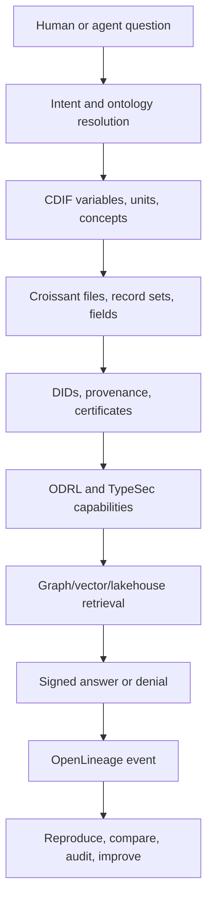

## Compression, Not Noise

One QueryGraph.ai theme is compression: a system understands something only
when it can reduce noise to a portable, structured signal. Querygraph applies
that idea to enterprise data. A raw table with 800 columns is not yet knowledge.
A table described by Croissant, grounded in CDIF variables, linked to ontology
terms, governed by ODRL, and indexed in a graph has been compressed into a form
an agent can safely use.

Example: an energy survey may contain a column that looks like a number. The
compressed semantic signal says what the number means, what unit it uses, which
geography it belongs to, which survey instrument produced it, whether a given
agent may summarize it, and what redaction rule applies before sharing.

## Freezing Time Without Freezing the World

Another theme is vector stabilization and temporal ground truth. Querygraph
does not claim that all knowledge is timeless. It assumes the opposite:
knowledge changes, models drift, policies change, and experts disagree. The
task is to record the time, source, authority, model, prompt, and data state
behind an answer so later agents can compare one answer to another.

Example: a climate-health briefing generated on June 14, 2026 should be
replayable against the same lakehouse manifest, Croissant/CDIF sidecars,
TypeDID envelopes, OpenLineage event, and DID attestation hash. If the answer
changes after a model upgrade or a dataset correction, Querygraph should show
what changed.

## The Data Infrastructure for Agentic AI

The QueryGraph.ai data-infrastructure post argues that responsible AI needs
context, provenance, and governance. Querygraph maps those directly:

- Context comes from Semantic Croissant, CDIF, OSI, controlled vocabularies,
  and Grust graph relationships.
- Provenance comes from Dataverse metadata, file hashes, OpenLineage events,
  DIDs, and signed TypeDID envelopes.
- Governance comes from RBAC, ODRL, TypeSec capabilities, and access receipts.

Example: an agent asks for a mobility-risk prediction. Querygraph does not
hand it every transportation table. It resolves the question to a mobility
compartment, identifies dockless-transportation and pedestrian-injury tables,
checks whether the agent may derive a summary, records the run, and returns
only a signed summary.

## Graph and Vector Navigation

The Palefire posts point toward graph-plus-vector navigation. Querygraph’s
current Rust implementation emphasizes the graph and lakehouse side, but the
architecture leaves room for vector stores. The graph identifies things:
datasets, variables, policies, agents, claims, prompts, and lineage events.
Vectors help discover similar things: related papers, near-synonymous terms,
translation candidates, or concept clusters.

Example: a user asks about "energy burden." A vector search may find related
phrases such as "energy insecurity" or "access to clean cooking." The graph
then decides which are official terms, which datasets contain them, what
ontology defines them, and what policies govern them.

## Digital Public Infrastructure

The AgStack post matters because it shows the same pattern outside a single
company. Agriculture, climate, health, food security, and geospatial identity
all need shared infrastructure. Querygraph’s lakehouse example is enterprise
shaped, but the architecture works for public infrastructure too:

- open datasets with rich metadata;
- decentralized identities for contributors and data products;
- policies that allow reuse while protecting sensitive resources;
- graph navigation across domains;
- local AI agents that can work even when central infrastructure is limited.

Example: a regional food-security agent could combine weather, crop, soil,
market, and logistics data. It should know which datasets are public, which are
licensed, which are embargoed, and which are local to a cooperative.

## Ontology-Driven Precise AI

The strongest version of Querygraph is ontology-driven precise AI. It is not
satisfied with "probably relevant chunks." It wants the exact concept, the
exact variable, the exact unit, the exact source, and the exact permission.

Precision does not mean rigidity. The navigator can still use LLMs, embeddings,
and agents. But those systems operate inside a semantic frame:

1. The question is mapped to ontology terms.
2. Terms are resolved to CDIF variables and OSI business concepts.
3. Variables are mapped to Croissant fields and Sail columns.
4. DIDs identify the requester, agent, service, dataset, and attestation
   issuer.
5. ODRL and TypeSec determine which actions are permitted.
6. Grust traverses the graph of datasets, policies, variables, agents, and
   lineage events.
7. Sail executes table access and stores audit records.
8. Ollama or another model receives only the governed prompt it is allowed to
   process.
9. OpenLineage records the run.
10. A DID attestation signs the root.

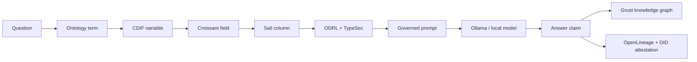

This is the opposite of a giant ungoverned context window. It is a precise
navigation path through meaning, authority, and permitted action.

## Source Posts

This vision section synthesizes the QueryGraph.ai posts on CODATA, Semantic
Croissant, responsible AI infrastructure, vector stabilization, compression,
Palefire, and AgStack:

- <https://querygraph.ai/alexy-interviews-slava-tykhonov-at-codata/>
- <https://querygraph.ai/moving-toward-a-verifiable-ai-future/>
- <https://querygraph.ai/compression-not-attention-is-all-you-need-for-ai/>
- <https://querygraph.ai/freezing-time-in-ai-how-vector-stabilization-captures-historical-ground-truth/>
- <https://querygraph.ai/building-data-infrastructure-for-agentic-ai/>
- <https://querygraph.ai/agstack/>
- <https://querygraph.ai/palefire/>
- <https://querygraph.ai/semantic-croissant/>

# The Querygraph Spine

Querygraph is built around a simple but demanding product promise: an agent
should be able to answer a serious question over enterprise data without
turning the enterprise into an unbounded prompt. The system must know what the
data is, where it came from, who is asking, which action is allowed, which
model was used, what the answer depends on, and how to replay the run.

That promise becomes the spine of the platform:

1. Semantic Croissant describes the data as agents will encounter it.
2. CDIF publishes the same data as interoperable FAIR metadata.
3. DIDs identify agents, datasets, bundles, issuers, and attestations.
4. CDRL expresses governed data rights in an ODRL-compatible layer.
5. TypeSec turns those identities and policies into typed capabilities.
6. Grust gives the navigator a graph of meaning, policy, lineage, and agents.
7. OSI gives business concepts stable names and relationships.
8. Sail executes the lakehouse and keeps the audit data queryable.
9. OpenLineage records runs, inputs, outputs, and derivations.
10. QG Lakehouse ties all of it together in Rust.

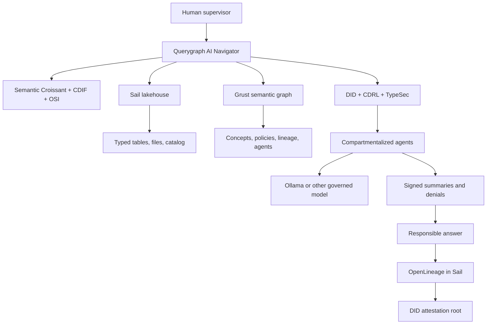

The rest of the book walks that spine component by component. Each chapter
answers three questions: why the component exists, how Querygraph uses it, and
what becomes possible when it is combined with the others.

# Semantic Croissant

Semantic Croissant is the moment a file becomes navigable. Before Croissant,
an enterprise lake is a heap of formats: CSV files, spreadsheets, Parquet
directories, APIs, attachments, survey exports, and institutional oddities with
names only a local analyst understands. After Croissant, an agent can ask a
more disciplined question: what datasets exist, what files belong to them,
what record sets they contain, what fields exist, what those fields mean, and
which types should be expected at runtime.

In Querygraph, Croissant is not decorative metadata. It is the first contract
between the lakehouse and the agent. A model should not see raw rows until a
semantic layer has explained the shape of those rows. That explanation is not
only for the model. It is for policy, validation, lineage, and replay.

The Rust implementation lives in `croissant.rs`. It defines a compact model of
datasets, file objects, record sets, and fields, then emits JSON-LD sidecars.
When the lakehouse loader parses a Dataverse or CODATA asset, it does two
things at once: it materializes a typed table for execution, and it materializes
a Croissant description so the table has a semantic face.

Consider the energy access survey in the demonstration lakehouse. A column may
look like an integer. Croissant lets Querygraph say more: this field came from
this file, belongs to this record set, represents this survey variable, has
this inferred type, and should be interpreted under this dataset. That is the
difference between an agent guessing and an agent navigating.

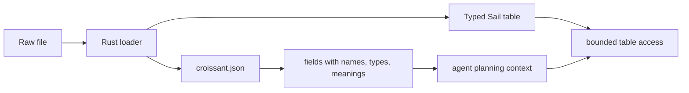

The important practical detail is that Croissant remains close to the data.
It describes the concrete files and tables that actually exist. Querygraph does
not ask Croissant to decide access policy, replace business ontology, or store
lineage events. It gives the navigator a trustworthy map of the terrain.

# CDIF

CDIF answers a different question from Croissant. Croissant says, "Here is how
this dataset is structured." CDIF says, "Here is how this dataset participates
in a larger interoperable data ecosystem." That distinction matters because an
AI Navigator must operate both inside a local lakehouse and across institutions,
domains, catalogs, and communities of practice.

In Querygraph, CDIF is the publication projection over the Croissant-grounded
asset. The Rust module `cdif.rs` projects datasets into profiles for discovery,
manifest, data description, data access, access rights, controlled vocabulary,
integration, universals, and provenance. Those profiles are not bureaucratic
checkboxes. They are the handles that make cross-domain AI possible.

Imagine a resilience analyst asking whether fiscal fragility and energy
insecurity overlap in vulnerable communities. Finance tables and energy survey
tables do not naturally speak the same language. CDIF helps Querygraph describe
the asset in a way another system can discover, compare, cite, and connect.
The CDIF projection gives the navigator publication-grade metadata while
Croissant remains the close-up record-set description.

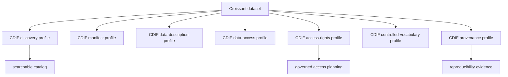

CDIF lives beside the lakehouse, not above it as an abstract aspiration. For
each dataset Querygraph loads, the sidecar `semantic/cdif.json` travels with
the corresponding prepared data and Croissant sidecar. The validator checks
that these semantic artifacts remain shaped correctly, because stale metadata
is worse than no metadata: it gives an agent confidence in the wrong map.

# DID

DIDs give Querygraph names that do not depend on a single database row or
cloud account. In ordinary software, a user, job, dataset, or model run may be
identified by whatever the local application happens to assign. In responsible
agentic AI, that is too weak. The system needs identifiers that can be carried
across messages, signatures, attestations, policies, and ledgers.

Querygraph uses DIDs for agents, bundles, issuers, and attestations. The demo
implementation in `did.rs` provides deterministic local `did:oyd` documents so
the examples can run without external ceremony. TypeSec then lifts those
identities into TypeDID envelopes and typed capability checks.

The practical value appears when something goes wrong. Suppose a supervisor
receives a summary that claims a climate-health pathway overlaps with an
energy-burden cluster. Querygraph should be able to say which agent produced
the claim, which DID identified that agent, which dataset DIDs or bundle DIDs
were in scope, which issuer signed the lineage attestation, and which payload
hash was signed. The DID is the thread that lets the answer be pulled back
through the system.

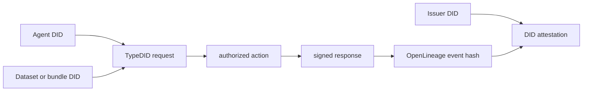

The DID ledger is intentionally compact. Querygraph does not need to store
every raw row or every full OpenLineage event in a DID ledger. The lakehouse is
better for large queryable event bodies. The ledger should store roots,
hashes, issuers, subjects, and signatures: enough to prove that the larger
record has not been quietly rewritten.

# CDRL

The user-facing name in this architecture is CDRL: the Contracted Data Rights
Layer. Its job is to make data rights concrete enough for agents to obey.
Under the hood, Querygraph implements this today with ODRL-style policy
objects in `odrl.rs`: targets, permissions, prohibitions, actions, and a simple
decision function used by the demos.

The distinction is useful. ODRL is the standards vocabulary for expressing
rights. CDRL is the Querygraph product layer that puts those rights into the
agent workflow. It is where enterprise contracts, role assignments, retention
rules, redaction requirements, embargoes, derivation limits, and model-use
constraints become a decision the navigator can enforce.

A CDRL policy should be able to say:

- this agent may read public finance data;
- this agent may summarize energy survey data but may not export raw rows;
- this broker may reveal restricted dataset metadata but not restricted
  respondent-level records;
- this model may receive a redacted prompt but not sensitive columns;
- this supervisor may aggregate signed summaries without inheriting every raw
  permission held by a specialist.

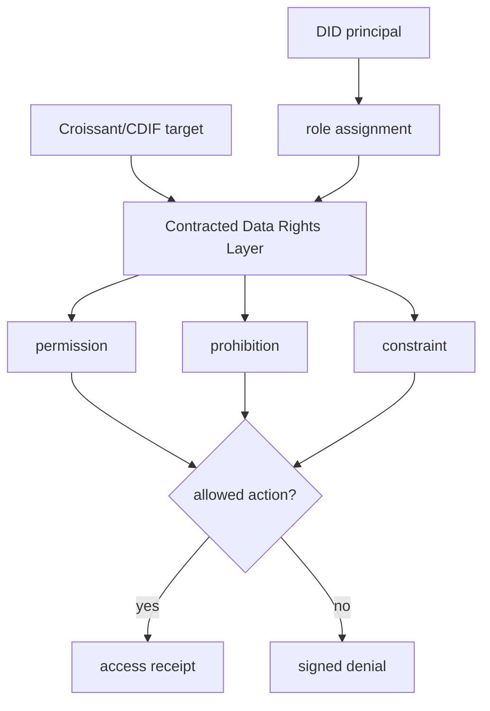

This chapter is where responsibility stops being a slogan. A responsible
system must be able to deny access in a way that is as legible and auditable as
approval. Querygraph treats denials as first-class outputs. They are signed,
included in lineage, and passed to synthesis agents so the final answer knows
which evidence was deliberately not used.

# TypeSec

TypeSec is the security fabric that makes the policy layer programmable
without making it squishy. Querygraph needs more than bearer tokens. Agents
delegate to other agents. Prompts become operational artifacts. Model calls
need bounded capabilities. Responses need signed provenance. A token that says
"this process is authenticated" is not enough.

TypeSec brings typed security to that world. In Querygraph, `agent.rs` builds
TypeDID request envelopes, access receipts, governed prompts, and signed
responses. The TypeDID protocol gives each agent interaction an identity-bound
envelope. The policy decision can then mint typed capabilities such as
`read`, `summarize`, `derive`, `normalize`, or `ai:infer` for a specific
resource and action.

The strongest example is the Ollama path. A local model is useful because it
keeps inference close to the data. But local inference is still dangerous if
the prompt is an ungoverned blob. Querygraph wraps the prompt in a TypeDID
envelope, checks the resource and action, and sends only the governed prompt
to the model. The response comes back as another signed artifact rather than a
loose string.

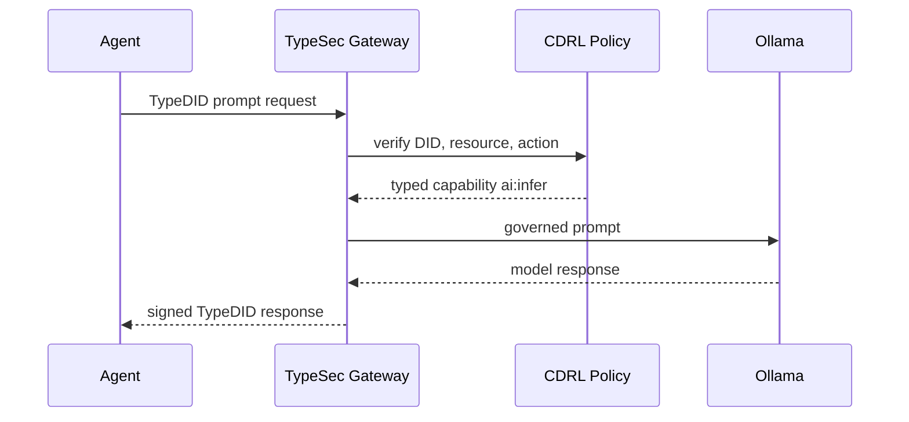

This is where TypeSec and DIDs become more than identity plumbing. They let
Querygraph preserve compartmentalization through an agent hierarchy. A
synthesis agent can receive signed summaries from specialists without
automatically receiving the raw permissions that produced those summaries.

# Grust

Grust gives Querygraph its graph mind. The lakehouse stores tables beautifully,
but an AI Navigator needs relationships: dataset contains file, file contains
record set, record set contains field, field maps to concept, concept belongs
to ontology, policy targets asset, agent has role, run consumed input, answer
derived from summary. These are graph-shaped facts.

In Querygraph, Grust is the property graph substrate that makes those facts
traversable from Rust. The module `sail.rs` stages Dataverse metadata and
semantic graph nodes through the Grust Sail adapter. The graph is not an
ornament beside the lakehouse. It is how the navigator plans safe routes
through data.

For example, an analyst may ask for mobility disruption in areas with fiscal
constraints. The graph can connect "mobility disruption" to transportation
datasets, injury severity tables, dockless transportation fields, urban-form
features, policies, and lineage from previous runs. Sail can then execute
the table operations. The graph decides where to go; the lakehouse carries the
weight.

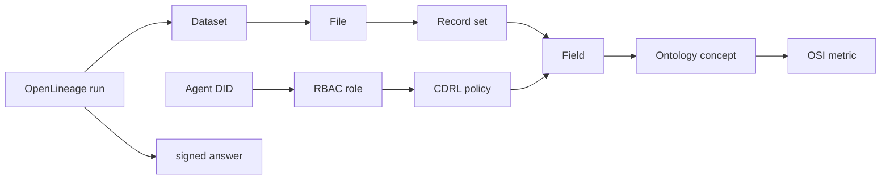

Rust matters here because graph navigation becomes systems programming when it
is part of a security boundary. Querygraph benefits from explicit types,
predictable serialization, careful error handling, and the ability to keep
graph, policy, metadata, and CLI code in one compiled implementation.

# OSI

Open Semantic Interchange is the business-meaning layer. Croissant knows the
shape of a dataset. CDIF knows how to publish it across ecosystems. OSI names
the business concepts that make the dataset useful to an enterprise or public
mission: metrics, dimensions, terms, relationships, and semantic models.

Without OSI, an AI Navigator can still find columns. With OSI, it can find the
right concept. That distinction matters when users ask ordinary human
questions. "Energy burden" may not be a column. It may be a concept composed
from survey variables, household context, geography, unit conventions, and
policy constraints. OSI gives Querygraph a place to model that concept instead
of hoping a vector search finds a nearby phrase.

The Rust module `osi.rs` loads or synthesizes an OSI model over datasets. In a
small demo, the model can be generated from Dataverse metadata. In a serious
deployment, the OSI model should be curated by domain experts and versioned
like application code.

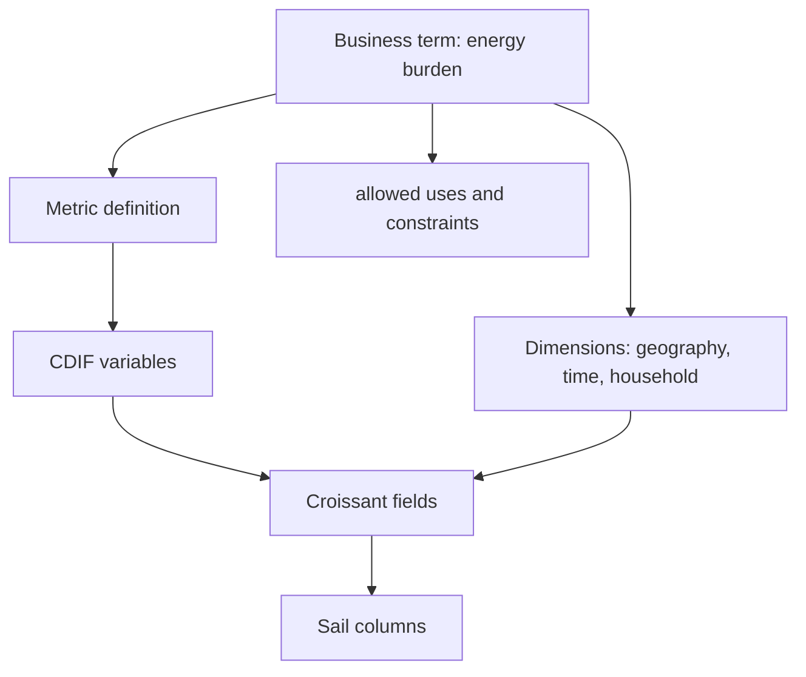

OSI is where ontology-driven AI becomes pleasant to use. Users should not need
to know table names to ask precise questions. Agents should not need to infer
business meaning from column labels alone. OSI provides the semantic bridge.

# OpenLineage

OpenLineage is the memory of what actually happened. Querygraph can generate
beautiful metadata and enforce careful policies, but an operator still needs
the operational story: which run executed, when it started, which job produced
which output, which datasets were inputs, which facets described the run, and
which event completed the derivation.

The implementation in `lineage.rs` constructs OpenLineage events, writes JSONL
and HTTP sinks, writes Sail audit rows, and creates TypeSec-backed DID
attestations. The key design choice is that OpenLineage belongs in Sail itself
for the local lakehouse. The event body is operational data. It should be
queryable beside the tables and metadata it describes.

When QG Lakehouse produces a resilience briefing, the lineage event records the
input scopes for finance, energy, mobility, climate-health, reference data, and
restricted metadata. The output is the briefing artifact. The DID attestation
then signs a compact hash of that event. Auditors get both convenience and
cryptographic accountability: query the full event in Sail, verify the root in
the DID ledger.

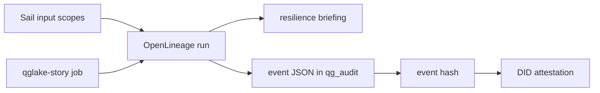

This is reproducibility as a product feature. The answer is not just text. It
is text with an execution trail.

# Sail

Sail is the right lakehouse substrate for Querygraph because it makes the data
layer local, inspectable, Spark-compatible, and Rust-friendly. Querygraph wants
to load real Dataverse and CODATA assets, infer strong column types, expose
tables to PySpark and Spark Connect, and store audit events next to the data.
Sail gives that work a serious execution surface without forcing the demo into
a remote warehouse account.

The local schema is `qg_lakehouse`. It contains typed tables and catalog
records such as `lakehouse_datasets`, `lakehouse_files`, and
`lakehouse_columns`. The audit schema is `qg_audit`. It stores OpenLineage
events and DID attestations. That separation mirrors the product boundary:
data and metadata in one governed space, operational evidence in another
governed space, both queryable.

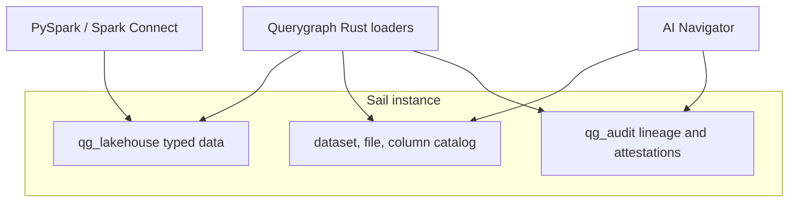

Rust is the right implementation language for this because the system lives at
the intersection of parsing, security, metadata, policy, graph traversal,
serialization, and reproducibility. These are not soft edges. A loader should
not silently coerce a sensitive identifier into nonsense. A policy evaluator
should not accidentally treat an absent prohibition as a broad grant. A
lineage attestation should not hash a different payload than the one written
to audit storage.

Rust helps Querygraph make those boundaries explicit. `Result`-driven error
handling keeps ingestion honest. `serde` keeps JSON-LD, OpenLineage, and
TypeDID envelopes structured. Strong enums make action vocabularies and event
types harder to confuse. Cargo keeps the CLI, library, tests, and book examples
close enough to evolve together. Sail gives the execution layer; Rust gives the
control layer.

# Python Interop

Rust is the control plane for Querygraph, but Python is the working surface for
many of the people who will use it. Data scientists live in notebooks. Spark
users expect PySpark. AI engineers assemble agents with Python libraries.
Analysts want to inspect a Sail warehouse without learning the Rust internals.
The sister project `qg-python` exists for that world.

The Python implementation is not a toy wrapper around a command line. It is a
Python-native ecosystem over the same concepts:

- `croissant.py` and `cdif.py` build Semantic Croissant and CDIF JSON-LD.
- `osi.py` projects Semantic Croissant fields into OSI datasets, metrics,
  expressions, and ontology terms.
- `typedid.py` models TypeDID envelopes, governed prompts, access receipts,
  and signed agent responses with Pydantic.
- `agents.py` exposes compartment agents and an optional LangChain
  `StructuredTool` adapter.
- `lakehouse.py` registers Sail warehouse Parquet tables in a PySpark/Spark
  Connect session.
- `lineage.py` emits OpenLineage run events and DID-style attestations.
- `cdrl.py` and `rbac.py` give Python agents the same rights checks used in
  the Rust story.
- `dataverse.py` projects Dataverse native API payloads into Semantic
  Croissant.
- `qglake.py` runs the Python version of the supervised QG Lakehouse story.

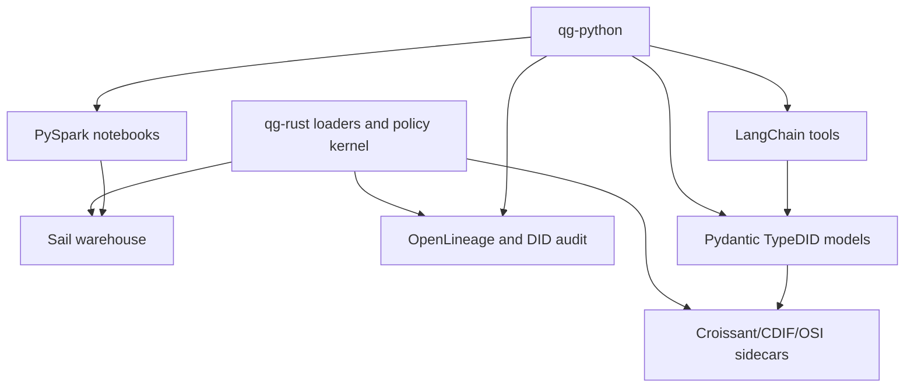

This division is deliberate. Rust is where Querygraph wants tight control:
ingestion, typing, hashing, policy boundaries, graph staging, and reproducible
CLI workflows. Python is where Querygraph wants fluent exploration: notebooks,
PySpark queries, LangChain tool composition, and domain-agent iteration.

## Pydantic

Pydantic is the Python side's type boundary. A TypeDID envelope should not be a
loose dictionary passed from one agent to another. A governed prompt should
have a question, semantic context, allowed sources, denied sources, and access
receipts. An agent response should have a status, summary, evidence,
redactions, and an envelope hash. Pydantic makes those shapes explicit while
remaining natural for Python users.

In `qg-python`, `TypeDidEnvelope` validates the request/reply structure and
recomputes payload hashes. `GovernedPrompt` carries the semantic context that
came from Croissant, CDIF, OSI, and Sail. `AgentResponse` preserves the signed
summary or denial. The synthesis agent receives those models, not ad hoc JSON.

The point is not type ceremony. The point is that Python agents can be
creative without being unbounded. Pydantic gives the agent framework a shape
that can be validated, logged, hashed, and compared to the Rust implementation.

## LangChain

LangChain fits as an adapter layer, not as the source of authority. Querygraph
does not ask LangChain to decide whether a model may see restricted data. That
decision belongs to DID identity, CDRL/ODRL policy, TypeSec capability checks,
and the semantic target in Croissant/CDIF/OSI. LangChain receives a governed
tool only after those boundaries exist.

The Python adapter `TypeDidLangChainToolAdapter` turns a TypeDID agent into a
LangChain `StructuredTool`. The tool returns the same signed response or denial
that a non-LangChain caller would receive. This keeps LangChain useful while
preventing it from becoming a policy bypass.

Example: a LangChain planner may choose `FinanceAgent` to summarize fiscal
capacity. The actual tool invocation still goes through a TypeDID request,
policy receipt, payload hash, and signed response. If the planner asks the
restricted broker for raw health rows, the tool returns a signed denial.

## PySpark

PySpark is the inspection and analysis surface for Sail. The Rust loader
materializes the warehouse. Python registers the generated Parquet tables into
a Spark Connect session and lets analysts query them with familiar Spark SQL.
That is how a user can inspect `qg_lakehouse` without leaving the Python world.

The current Python helper can register the loaded data tables and the audit
tables:

```bash
uv run querygraph lakehouse-register \
  --manifest ../qg-rust/.querygraph/lakehouse/manifest/load-report.json \
  --warehouse ../qg-rust/spark-warehouse

uv run querygraph audit-register --warehouse ../qg-rust/spark-warehouse
```

Then a notebook or shell can ask:

```python
spark.sql("SELECT COUNT(*) FROM global_temp.government_finance__countydata").show()
spark.sql("SELECT quantity, value, unit FROM global_temp.codata_constants_2022__codata_constants_2022 LIMIT 5").show(truncate=False)
spark.sql("SELECT event_hash, event_type, job_name FROM global_temp.openlineage_events LIMIT 10").show(truncate=False)
```

That is the interop story in one loop: Rust loads, Sail stores, Python queries,
Pydantic agents reason, LangChain orchestrates when useful, and OpenLineage
records the trail.

# The Demonstration Datasets

The default corpus is intentionally broad. It is not a toy table. It mixes
finance, energy, transportation, health, climate, social science, geospatial
assets, and reference data so the navigator has to cross real semantic
boundaries.

| Dataset | Category | Persistent ID or source | Typed tables | Rows | Why it matters |
| --- | --- | --- | ---: | ---: | --- |
| Government Finance Database | finance | `doi:10.7910/DVN/LMS8NT` | 6 | 1,724,447 | Fiscal capacity, county/municipal/district budgeting, and public-sector constraints. |
| Roadway vulnerability LiDAR DTM | geospatial | `doi:10.7910/DVN/1VT6FZ` | 0 | 0 | Non-tabular assets and geospatial metadata; proves the catalog can track assets that are not immediately typed tables. |
| ACCESS 2018 energy survey | energy | `doi:10.7910/DVN/AHFINM` | 3 | 35,779 | Household access to clean cooking energy and electricity. |
| Dockless transportation study | transportation | `doi:10.7910/DVN/B2LJSB` | 7 | 479,853 | Urban form, trip hotspots, mode shift, and mobility disruption. |
| HAALSI Baseline Survey | health | `doi:10.7910/DVN/F5YHML` | 0 | 0 | Restricted or inaccessible raw data; demonstrates metadata-only access and signed denial. |
| Global Party Survey, 2019 | social science | `doi:10.7910/DVN/WMGTNS` | 5 | 6,033 | Institutional and political context as a social-science signal. |
| Connecticut pedestrian injury severity | transportation | `doi:10.7910/DVN/TXIKF9` | 1 | 14,645 | Injury severity, land use, transit stops, roadway, and demographic factors. |
| Energy insecurity during COVID-19 | energy | `doi:10.7910/DVN/OMJWNB` | 3 | 37,907 | Sociodemographic disparities in household energy insecurity. |
| Climate and health pathways | climate health | `doi:10.7910/DVN/DHDNIC` | 2 | 522 | Climate-linked mortality and pathway data. |
| CODATA/NIST 2022 constants | reference | NIST ASCII table | 1 | 355 | Trusted reference units and constants for normalization. |

The loaded corpus verifies to 28 typed tables and 2,299,541 typed rows. The
row count is not the point by itself. The point is heterogeneity: tabular
files, XLSX conversion, CODATA normalization, non-tabular assets, and
restricted data all travel through one governed catalog.

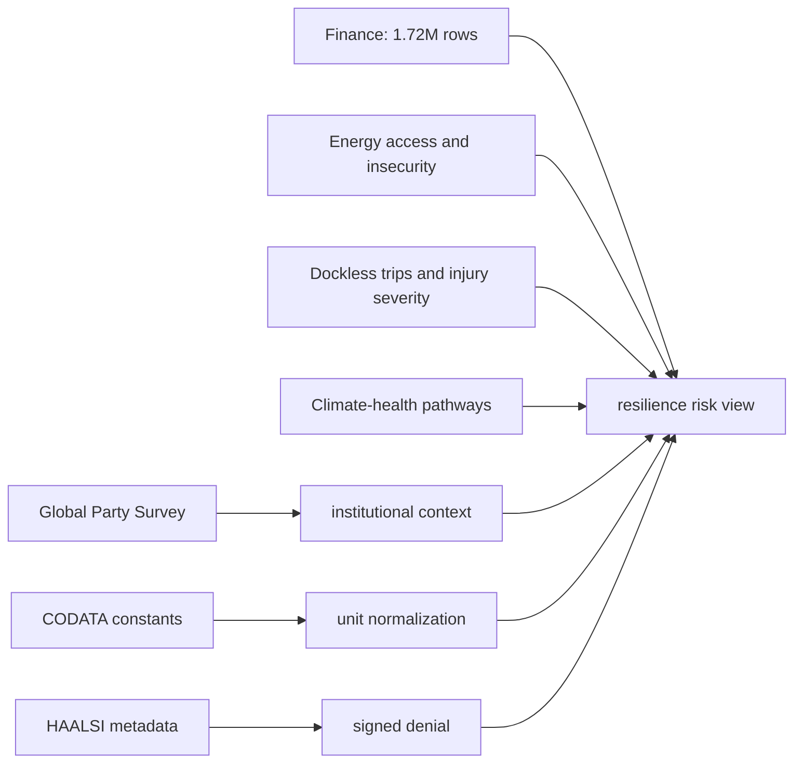

# QG Lakehouse with All Components

QG Lakehouse is where the chapters stop being separate ideas and become a
single run. The executable story is:

```bash
cargo run -- qglake-story
```

The default output is a readable briefing. The full machine report is:

```bash
cargo run -- qglake-story --json
```

The story asks a mission-shaped question:

> Where do fiscal capacity, energy burden, mobility disruption, and
> climate-health risk overlap, and what can a supervisor responsibly know
> without violating restricted-data boundaries?

The answer is not a single omniscient model response. It is a governed
multi-agent run over Sail, Grust, Semantic Croissant, CDIF, OSI, DIDs, CDRL,
TypeSec, OpenLineage, and optional Ollama inference.

## Step 1: Load the Lakehouse

The first step is ingestion. `lakehouse.rs` downloads the default Dataverse and
CODATA corpus, normalizes parseable assets, infers strong column types, writes
typed tables, and records a manifest. This is where Rust earns its keep: every
file has to become either a typed table, a cataloged non-tabular asset, or an
explicitly reported unavailable/restricted asset.

The lakehouse does not hide partial success. A LiDAR asset can be cataloged
even when it is not a table. A restricted survey can contribute metadata while
raw rows remain unavailable. The navigator can reason over both facts.

```bash
cargo run -- lakehouse-load --root .querygraph/lakehouse --schema qg_lakehouse
cargo run -- lakehouse-verify --report .querygraph/lakehouse/manifest/load-report.json
```

## Step 2: Materialize Semantic Croissant

For each loaded dataset, Querygraph writes a `semantic/croissant.json` sidecar.
This sidecar names files, record sets, and fields so agents can inspect the
data before requesting access. It is the catalog entry an agent can actually
understand.

In the story, FinanceAgent does not receive a vague instruction to "look at
finance data." It receives a semantic projection of the government-finance
tables it is allowed to summarize. The projection tells the agent what tables
and fields exist, and the policy layer tells it what action is allowed.

## Step 3: Project CDIF

Next, Querygraph writes `semantic/cdif.json`. The CDIF sidecar takes the same
dataset and expresses it through interoperable profiles: discovery, manifest,
data access, access rights, controlled vocabulary, integration, universals, and
provenance.

This is how QG Lakehouse avoids becoming a private demo format. The local Sail
schema can be inspected by Spark, the sidecars can be shared with FAIR data
tools, and the graph can connect local variables to broader community
semantics.

## Step 4: Build the OSI Semantic Model

The OSI layer turns dataset metadata into business concepts. In the example,
the user asks about fiscal capacity, energy burden, mobility disruption, and
climate-health risk. Those are not merely table names. They are concepts that
must be connected to metrics, dimensions, variables, fields, and policies.

`osi.rs` can synthesize a model from available metadata for the demo. In a real
deployment, this is where domain experts make the navigator precise: they
define the terms the organization actually uses and connect them to the data
that can support those terms.

## Step 5: Load the Grust Graph

Grust turns semantic metadata into navigable relationships. The graph can say
that a dataset has files, a file has record sets, a field maps to a concept, a
concept appears in a policy, an agent has a role, and a run produced an answer.

The graph does not replace Sail. It makes Sail usable by agents. Sail answers
table questions. Grust answers route questions.

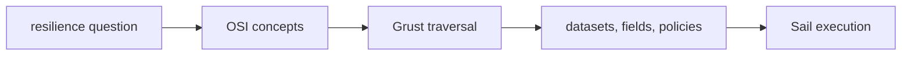

## Step 6: Identify Agents with DIDs

Every actor in the story has an identity: SupervisorAgent, FinanceAgent,
EnergyAgent, MobilityAgent, ClimateHealthAgent, ReferenceAgent,
RestrictedDataBroker, and SynthesisAgent. Those identities are represented as
DIDs and carried through TypeDID envelopes.

The supervisor is powerful, but not magical. Its DID allows orchestration. It
does not automatically grant raw access to every compartment. That is the
central discipline of the platform.

## Step 7: Apply CDRL Rights

The CDRL layer evaluates what each agent may do. FinanceAgent can read or
summarize finance assets. EnergyAgent can derive approved energy summaries.
RestrictedDataBroker can inspect restricted metadata but cannot reveal raw
restricted health records.

| Agent | Compartment | Allowed action | Explicit boundary |
| --- | --- | --- | --- |
| FinanceAgent | `compartment:finance` | `read`, `summarize` | No energy or health raw data. |
| EnergyAgent | `compartment:energy` | `summarize`, `derive` | No respondent-level restricted data. |
| MobilityAgent | `compartment:mobility` | `summarize`, `derive` | No finance-table mutation. |
| ClimateHealthAgent | `compartment:climate-health` | `summarize`, `derive` | No restricted health rows. |
| ReferenceAgent | `compartment:reference` | `normalize` | Can normalize units, not expand access. |
| RestrictedDataBroker | `compartment:restricted` | metadata-only receipt | Raw access denied. |
| SynthesisAgent | `compartment:synthesis` | aggregate signed summaries | Does not inherit raw specialist permissions. |

The signed denial is as important as the signed summary. It prevents a
supervisor from silently assuming evidence was considered when it was not.

## Step 8: Mint TypeSec Capabilities

Once a policy decision is made, TypeSec turns it into typed capability evidence.
The capability is scoped to an action, resource, principal, and envelope. This
is the difference between "the process is authenticated" and "this agent may
perform this operation on this semantic asset for this run."

TypeDID envelopes carry the request and response. They bind the agent identity,
resource, action, payload hash, and signature. The result is an agent protocol
that can be logged, replayed, and audited.

## Step 9: Route to Compartmentalized Agents

The supervisor delegates instead of centralizing all data. FinanceAgent,
EnergyAgent, MobilityAgent, ClimateHealthAgent, ReferenceAgent, and
RestrictedDataBroker work inside their compartments. They produce signed
summaries, normalization notes, and denial receipts.

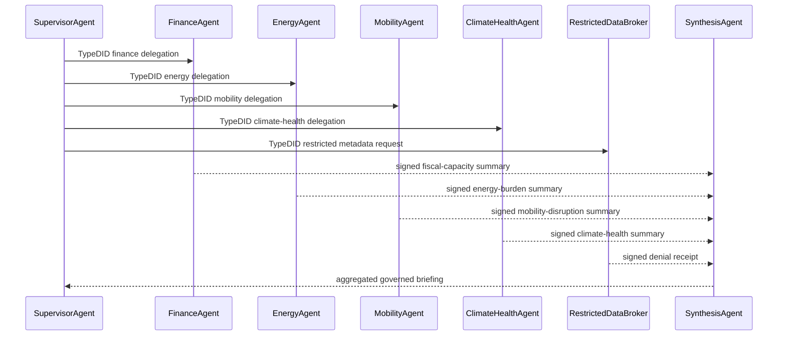

This is the human organizational model reflected in software. A supervisor can
coordinate experts without becoming every expert and without inheriting every
restricted permission.

## Step 10: Call Ollama Through TypeDID

When the run uses a local model, Querygraph calls Ollama only after TypeSec has
verified the governed prompt. The model receives a bounded question with
approved context. It does not receive the lakehouse. It does not receive
restricted rows merely because a prompt asked nicely.

In the JSON report, this appears under the Ollama TypeDID path. The important
thing is not Ollama specifically. It is the pattern: any model runtime should
be downstream of identity, semantics, policy, and lineage.

## Step 11: Synthesize Without Boundary Collapse

The synthesis agent receives signed summaries and hashes. It aggregates them
into a resilience briefing:

> Priority areas are those where weak fiscal capacity, energy burden, mobility
> fragility, and climate-health exposure overlap. Restricted health data
> contributed only a signed metadata/denial receipt, so the briefing uses
> approved compartment summaries rather than raw restricted rows.

This is the product experience Querygraph is aiming for: a useful answer that
also tells the truth about its limits.

## Step 12: Emit OpenLineage to Sail

The run emits a `COMPLETE` OpenLineage event. Inputs include each Sail scope.
The output is the briefing. The job name, run id, producer, event time, and
facets become queryable audit data in `qg_audit`.

OpenLineage in Sail means operators can ask ordinary lakehouse questions about
AI behavior. Which datasets were used in this briefing? Which model path was
called? Which runs touched energy survey data? Which answers included a
restricted-data denial?

## Step 13: Anchor the DID Attestation

Finally, Querygraph signs a compact attestation root. The full event remains
in Sail. The DID ledger carries the issuer, subject, Merkle root, signature,
and payload hash. This gives the platform a verifiable memory without turning
the ledger into a dumping ground for operational data.

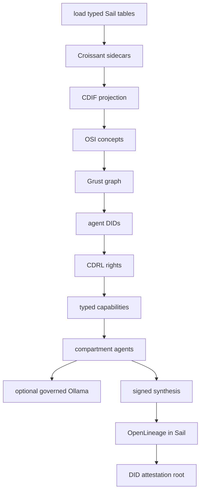

# Rust Examples

The Rust examples are the reference implementation. They show the system from
the operator and platform-engineering side: load real data, materialize typed
tables, generate semantic metadata, enforce rights, run agents, and emit audit
evidence.

## Build a Four-Layer Semantic Bundle

The smallest useful Rust run builds the original AI Navigator bundle:

```bash
cargo run -- navigator \
  --dataset-name "Hazard vocabulary" \
  --description "Controlled vocabulary with multilingual technical terms" \
  --landing-page "https://querygraph.ai/datasets/hazards" \
  --data-url "https://querygraph.ai/datasets/hazards.csv" \
  --creator "QueryGraph" \
  --agent-name "AI Navigator"
```

That command produces a JSON-LD bundle with:

- Semantic Croissant for dataset shape;
- CDIF for FAIR discovery, data access, access rights, and data elements;
- a DID document for the navigator;
- ODRL policy for read, index, and derive boundaries.

This is the seed pattern for every richer workflow. A dataset should always
enter the agent world with shape, publication metadata, identity, and policy.

## Load and Verify the Sail Warehouse

The lakehouse loader is the Rust example that proves Querygraph can handle more
than toy JSON:

```bash
cargo run -- lakehouse-load \
  --root .querygraph/lakehouse \
  --schema qg_lakehouse

cargo run -- lakehouse-verify \
  --report .querygraph/lakehouse/manifest/load-report.json

cargo run -- lakehouse-validate \
  --report .querygraph/lakehouse/manifest/load-report.json
```

The loader downloads Dataverse and CODATA assets, prepares parseable files,
infers column types, writes Sail tables, emits Croissant/CDIF sidecars, and
records row counts in a manifest. The verifier checks that the executable data
matches the report. The validator checks that the semantic sidecars and audit
shapes are still usable.

## Run the Supervised Agent Story

The readable story:

```bash
cargo run -- qglake-story
```

The machine report:

```bash
cargo run -- qglake-story --json
```

The Rust story is intentionally elaborate. It creates a supervisor, specialist
agents, restricted broker, synthesis agent, TypeDID requests and responses,
RBAC and CDRL/ODRL receipts, Semantic Croissant and CDIF projections, an
OpenLineage event, and a DID attestation. It demonstrates the product rule:
aggregate signed summaries without collapsing raw-data boundaries.

## Run the Live Sail, TypeDID, OpenLineage, and Ollama Path

With Sail running:

```bash
sail spark server --port 50051
```

Run the live end-to-end path:

```bash
cargo run -- dataverse-e2e \
  --live-sail \
  --sail-endpoint http://127.0.0.1:50051 \
  --openlineage-file .querygraph/openlineage/events.jsonl \
  --did-ledger-file .querygraph/did-ledger/attestations.jsonl
```

When Ollama is available, the same path can wrap model inference through
TypeDID. The important property is the order: semantic target first, policy
decision second, typed capability third, model call fourth, lineage fifth.

## Rust as the Contract

The Rust examples define the contract that other languages should preserve.
Python may be more comfortable for notebooks and agent composition, but it
should not silently change CDIF shape, policy semantics, payload hashes, or
lineage meaning. That is why `qg-python` includes an equivalence test against
the Rust `navigator` command.

# Python Examples

The Python examples are the user-facing and notebook-facing complement to the
Rust examples. They do not replace the Rust lakehouse loader. They make the
warehouse, semantic sidecars, agent protocol, and audit trail easy to inspect,
compose, and extend.

From the sister project:

```bash
cd ../qg-python
uv sync --extra test
uv run python -m pytest
```

The test suite checks both Python-only behavior and Rust equivalence for the
semantic bundle. That matters because Python agents should speak the same
semantic and security language as the Rust platform.

## Build OSI from Semantic Croissant

`examples/osi_semantic_croissant.py` starts with a concrete Croissant dataset:
files, record sets, fields, types, and semantic meanings. It then projects the
dataset into an OSI model:

```bash
uv run python examples/osi_semantic_croissant.py
```

The result has:

- an OSI dataset whose source points at Sail;
- fields mapped from Croissant fields;
- Sail SQL expressions for field access;
- ontology terms derived from semantic field identifiers;
- a simple metric such as `row_count`.

This is the bridge from file metadata to business meaning. The agent does not
need to guess that `monthly_energy_cost` belongs to an energy-burden concept.
The OSI model says so.

## Query Sail with PySpark

After the Rust loader has materialized the warehouse, start Sail:

```bash
cd ../qg-rust
sail spark server --port 50051
```

Register the data and audit tables from Python:

```bash
cd ../qg-python
uv sync --extra lakehouse
uv run querygraph lakehouse-register \
  --manifest ../qg-rust/.querygraph/lakehouse/manifest/load-report.json \
  --warehouse ../qg-rust/spark-warehouse

uv run querygraph audit-register \
  --warehouse ../qg-rust/spark-warehouse
```

Open a shell:

```bash
uv run pyspark --remote sc://127.0.0.1:50051
```

Example queries:

```python
spark.sql("SELECT COUNT(*) AS rows FROM global_temp.government_finance__countydata").show()
spark.sql("SELECT COUNT(*) AS rows FROM global_temp.codata_constants_2022__codata_constants_2022").show()
spark.sql("SELECT quantity, value, unit FROM global_temp.codata_constants_2022__codata_constants_2022 LIMIT 5").show(truncate=False)
spark.sql("SELECT event_hash, event_type, job_name FROM global_temp.openlineage_events LIMIT 10").show(truncate=False)
```

This gives Python users direct inspection of both governed data and audit
evidence.

## Run TypeDID Agents with Pydantic

The Python QG Lakehouse story is:

```bash
uv run querygraph qglake-story --pretty
```

It creates the same cast as the Rust story: supervisor, finance, energy,
mobility, climate-health, reference, restricted-data broker, and synthesis.
Each request and response is a Pydantic TypeDID model. Each response carries a
payload hash. The restricted broker returns a denial instead of leaking raw
data. The final report includes OpenLineage and a DID-style attestation.

A minimal Python sketch looks like this:

```python
from querygraph.typedid import TypeDidAgent

supervisor = TypeDidAgent.new("SupervisorAgent")
finance = TypeDidAgent.new("FinanceAgent")

request = supervisor.request(
    finance,
    action="summarize",
    resource="compartment:finance",
    payload={"question": "Where is fiscal stress highest?"},
)

response = finance.answer(
    request,
    status="allowed",
    summary="Fiscal stress summary over governed finance tables.",
)

assert request.verify_payload()
assert response.envelope.payload["requestSha256"] == request.payload_sha256
```

This is what Pydantic contributes: a natural Python object model that is still
strict enough to validate, hash, serialize, and test.

## Adapt a TypeDID Agent to LangChain

LangChain is useful when a planner should choose tools. Querygraph's rule is
that the tool must already be governed. The Python adapter turns a TypeDID
agent into a LangChain `StructuredTool`:

```bash
uv sync --extra agents
uv run python examples/typedid_langchain_agents.py
```

Conceptually:

```python
from querygraph.agents import TypeDidLangChainToolAdapter, deterministic_specialist
from querygraph.typedid import TypeDidAgent

finance = TypeDidAgent.new("FinanceAgent")
handler = deterministic_specialist(
    finance,
    summary="Fiscal capacity summary from governed Sail finance tables.",
    evidence=["global_temp.government_finance__countydata"],
)
tool = TypeDidLangChainToolAdapter(finance, handler).as_tool()
```

The LangChain planner can invoke the tool, but the tool returns a TypeDID
response. The planner does not receive a secret back door into Sail.

## Python as the Experiment Surface

Python is where new agent behavior can be prototyped quickly:

- tune OSI concept mappings;
- inspect Sail tables with PySpark;
- build notebook dashboards over OpenLineage events;
- try LangChain planners over governed tools;
- compare Pydantic TypeDID outputs with Rust TypeDID outputs;
- write domain-specific specialist agents before hardening them in Rust.

The ideal development loop is not Rust versus Python. It is Rust for the
contract and Python for the exploration, both operating over the same Sail
warehouse and the same semantic sidecars.

# Operator Workflow

A normal local workflow looks like this:

```bash
sail spark server --port 50051
cargo run -- lakehouse-load --root .querygraph/lakehouse --schema qg_lakehouse
cargo run -- lakehouse-verify --report .querygraph/lakehouse/manifest/load-report.json
cargo run -- lakehouse-validate --report .querygraph/lakehouse/manifest/load-report.json
cargo run -- qglake-story
```

For the full machine-readable story:

```bash
cargo run -- qglake-story --json
```

For a live TypeDID, Sail, OpenLineage, and Ollama path:

```bash
cargo run -- dataverse-e2e \
  --live-sail \
  --sail-endpoint http://127.0.0.1:50051 \
  --openlineage-file .querygraph/openlineage/events.jsonl \
  --did-ledger-file .querygraph/did-ledger/attestations.jsonl
```

# Where Querygraph Goes Next

The current codebase is the compact kernel:

- typed Sail lakehouse loading;
- Semantic Croissant and CDIF sidecars;
- OSI model projection;
- Grust-backed semantic graph loading;
- DID and TypeSec TypeDID agent envelopes;
- CDRL/ODRL rights, RBAC, approvals, and denials;
- OpenLineage in Sail with DID attestation.

The next product shape is a long-running `querygraphd` service with APIs for
model import, semantic search, access explanation, governed planning, answer
generation, and audit verification.

Querygraph’s ambition is not to replace Sail, Grust, TypeSec, OSI, Croissant,
CDIF, ODRL, OpenLineage, or Dataverse. It is to make them work together as one
agent-safe semantic operating layer: precise enough for data scientists,
legible enough for auditors, and alive enough for agents to navigate.
